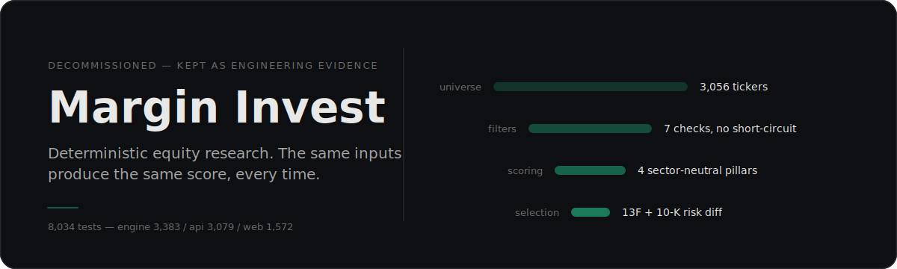
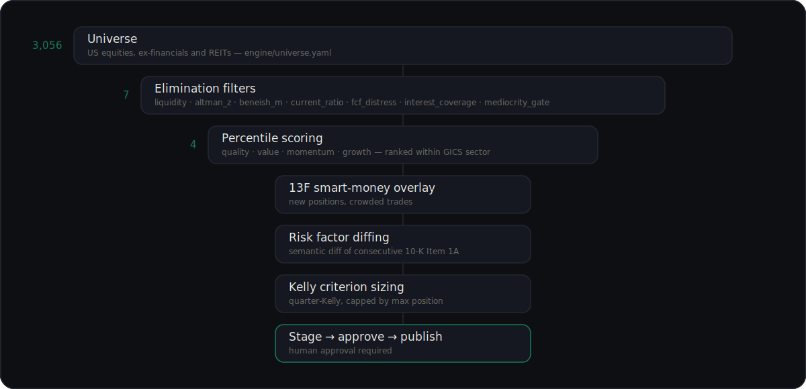

<p align="center">
  
</p>

> **Status: decommissioned.** The live service shut down May 2026. The Railway services are dead, Stripe is closed, DNS is parked or lapsed. This repo stays public as a portfolio piece. No further development — don't open PRs, fork if you want it.

Margin Invest ingested financial data, ran elimination filters, scored the survivors on sector-neutral percentile ranks, overlaid 13F smart-money signals, and sized positions with the Kelly criterion. Same inputs, same outputs, every time.

The product was killed because the market for it wasn't there. The engineering is left here intact.

## Start here

If you're hiring for an AI/ML or backend role and opened this looking for signal, these are the places worth your time.

**[`engine/src/margin_engine/ml/`](engine/src/margin_engine/ml/) — multi-seed validation.** Training runs 20 seeds per cycle, and a model only stages if the *distribution* clears all three gates: median rank IC ≥ 0.15, IC coefficient of variation ≤ 0.50, worst seed IC ≥ 0.05 ([`seed_validation.py`](engine/src/margin_engine/ml/seed_validation.py)). One lucky seed can't ship. Every run persists an environment snapshot.

**[`api/src/margin_api/services/risk_diffing/`](api/src/margin_api/services/risk_diffing/) — the one genuinely novel piece.** Semantic diff of consecutive 10-K Item 1A Risk Factors: `voyage-finance-2` embeddings to find what changed, then Claude Haiku 4.5 with prompt caching to judge whether the change *matters*. Cost is metered per call from token rates.

**[`evals/risk_factor_diffing/`](evals/risk_factor_diffing/) — the eval harness, and the clearest thing I left unfinished.** Five golden cases are seeded with real SEC accession numbers, the risk shifts each filing should have surfaced, and what actually happened next — SVB down 99.7% two months after its 2022 10-K; Enron, WorldCom, Wirecard, Luckin. The runner computes precision, recall, and mean severity error against a prior run.

It never ran for real. `risk_factors_text` is still `PLACEHOLDER` in all five cases ([`golden_set.jsonl`](evals/risk_factor_diffing/golden_set.jsonl)) — I didn't backfill the filing text before the product died. The [design doc](docs/superpowers/specs/2026-04-21-filing-diffing-design.md) targets of ≥70% precision, ≥60% recall, and a 5% regression budget were intent, never enforced in code. The shape is right and it's the pattern I'd reach for on any LLM feature — change the prompt, measure, ship or revert — but this is scaffolding, not evidence.

**[`api/src/margin_api/workers.py`](api/src/margin_api/workers.py) — 34 ARQ functions, 15 cron jobs.** Daily ingest → score → stage → approve → publish, with circuit breakers on score drift and ingestion failure. It's one 5,559-line file, which is the honest answer to what this looked like in production.

The part I'd defend hardest is governance: no score and no ML model reached a user without a human approving it. Events fire to a Redis stream ([`governance_events.py`](api/src/margin_api/services/governance_events.py)) and roll up into a `governance_events` table; outbound webhooks are signed HMAC-SHA256 and retried 5 times before dead-lettering ([`webhook_dispatcher.py`](api/src/margin_api/services/webhook_dispatcher.py)).

## Determinism, concretely

No scoring formula shipped without a golden-value test. The fixtures are real filings, not fabricated numbers — every value below is traceable to Apple's FY2024 10-K:

```python
# engine/tests/fixtures/golden_apple_2024.py
EXPECTED = {
    "gross_margin_2024": 0.4621,      # 180683 / 391035
    "revenue_growth":    0.0202,      # (391035 - 383285) / 383285
    "fcf_2024":          108295000000,
    "roa_2024":          0.2568,      # 93736 / 364980
}
```

Any drift in a formula fails a test that names the filing it came from. LLM calls run at `temperature=0`.

## The pipeline

<p align="center">
  
</p>

Two details the diagram flattens. The filters run **before** scoring but **without** short-circuit — every filter evaluates even after one fails, so an eliminated asset carries a complete diagnostic record of *why*. And scoring has two paths: the default v4 composite is a weighted arithmetic mean of the pillars ([`composite.py`](engine/src/margin_engine/scoring/composite.py)), while the v3 path uses a weighted geometric mean with a floor ([`v3_composite.py`](engine/src/margin_engine/scoring/v3_composite.py)). Cyclical sectors normalize on a 7-year median.

## Architecture

Monorepo, three packages.

| Package | Purpose | Stack |
| --- | --- | --- |
| `engine/` | Scoring library, zero web deps | Python 3.13, `uv` workspace |
| `api/` | FastAPI service + ARQ workers | FastAPI, SQLAlchemy 2.0, asyncpg, Alembic, Redis, ARQ |
| `web/` | Marketing site + dashboard | Next.js 16, React 19, Tailwind v4, Vitest |

Supporting cast: PostgreSQL 16, Redis + ARQ, `next-auth` v5 with WebAuthn and TOTP. Anthropic SDK direct (Haiku 4.5 and Sonnet 4.6, prompt caching), Voyage AI `voyage-finance-2` embeddings, scikit-learn, LightGBM, PyTorch. Formerly Stripe, Resend, Sentry, PostHog, and Railway — API service plus a separate ARQ worker.

## Running it locally

```bash
# prereqs: uv, Node 22+, Docker, Postgres 16, Redis
brew install postgresql@16 redis
createuser -s margin
psql -c "ALTER USER margin WITH PASSWORD 'margin_dev';"
createdb -O margin margin_invest

cp .env.example .env  # fill in keys for FMP, Polygon, Anthropic, Voyage, etc.

uv sync
docker compose up -d  # Redis
uv run alembic upgrade head
uv run uvicorn margin_api.app:create_app --factory --reload

cd web
pnpm install
pnpm dev
```

Tests — 8,034 of them:

```bash
uv run pytest engine/tests/ -v                                              # 3,383
uv run pytest api/tests/ -v --ignore=api/tests/services/test_xbrl_parser.py # 3,079
cd web && npx vitest run                                                    # 1,572
```

`test_xbrl_parser.py` is knowingly broken and must be ignored; it's exempt in `pyproject.toml`.

## What this repo is not

- Not investment advice. Alignment with the SEC publisher's exclusion was a design constraint, not the goal.
- Not running. See the status note above.
- Not maintained.

## Why it was killed

Three reasons, in priority order:

1. **No user pull.** Deterministic equity scoring is a thing retail traders *say* they want and don't pay for. The Stripe data was clear.
2. **Compliance gravity.** Every shipped feature dragged in fresh legal review. Product-market fit needed to be far stronger to justify that drag.
3. **My time was better spent.** Higher-leverage paths exist for an engineer moving into AI roles. This codebase already proves what it needs to prove.

The brand and domain were portfolio scaffolding. They served their purpose.

## License

See [LICENSE](LICENSE) — all rights reserved. If you want to reuse pieces, ask.
